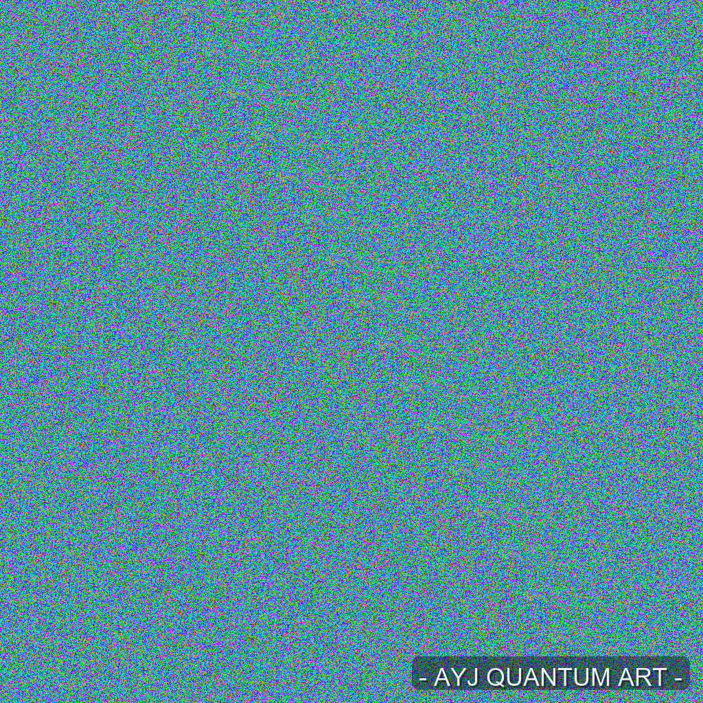

# Quantum Art — Single-Qubit Generated Artwork



## Overview
**Quantum Art** uses a *single simulated qubit* (Hadamard → measurement collapse)  
to paint an image pixel by pixel.  
Each bit of color is determined by quantum probability, not classical randomness.

This image (`1024×1024`) contains **over 3 million qubit collapses**  
simulated via `Qiskit`’s Aer simulator — effectively the *world's first*  
artwork created using a **single qubit as the brush**.

## How it works
- Each qubit initialized as \|0>
- Apply Hadamard gate → superposition  
- Measure → collapse (0 or 1)  
- Repeat thousands/millions of times to fill RGB bitplanes

## Requirements
```bash
pip install qiskit qiskit-aer pillow numpy
